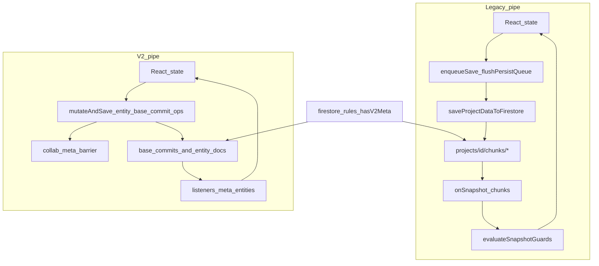

# Shared project dual-path inventory (legacy chunks vs V2 collab)

**Purpose:** Single checklist of everywhere the app and Firestore rules implement **two** collaboration models in parallel: **legacy** whole-project chunk snapshots under `projects/{projectId}/chunks` (and related paths), versus **V2** commit-barrier collaboration (`collab/meta`, `base_commits/...`, revisioned entity collections).

**How to use:** When hardening, cutting over, or removing one path, update this file in the same PR as code/rules changes. Each row should stay accurate: *legacy behavior*, *V2 behavior*, *after single-path cutover*.

**Related canonical docs:** [`SHARED_PROJECT_COLLAB_V2.md`](./SHARED_PROJECT_COLLAB_V2.md), [`ARCHITECTURE.md`](./ARCHITECTURE.md), [`PERSISTENCE_AUDIT.md`](./PERSISTENCE_AUDIT.md), [`AGENTS.md`](./AGENTS.md).

**Research notes:** Inventory built from full read of [`firestore.rules`](./firestore.rules), repo-wide grep of `src/**/*.ts(x)`, and targeted exploration of persistence modules (March 2026). Re-run greps before large refactors; paths like `.deploy/KWG/` may mirror `src/` and are **not** source of truth.

### Foundation position (read first)

**The dominant structural cause of collaborator desync here is not “unknowable sync magic” — it is maintaining two live collaboration architectures** (legacy chunk snapshots vs V2 `collab/meta` + commits + entities) **for one product**, with **mode switches** (`storageMode` / `readMode`), **duplicate write and listen paths**, and **rules forks** (`hasV2Meta`). Every class of bug that looks like “A and B disagree” ultimately ties back to **which pipe ran**, **whether rules and client agreed**, and **whether a write was real**.

**This inventory enumerates those surfaces** (§§3–8, §12–13). That is the **cause map** for this codebase.

**New baseline / foundation fix:** **One** persistence contract for shared projects end-to-end — **target state: V2-only** after **data migration**, **rules that deny legacy chunk writes**, and **client code that deletes the legacy mirror path** (see §11). That is the **architectural** end state that removes the dual-system failure class.

**Phased audits, tests, and truth-or-error work on both paths** are **stabilization while mixed production data and mixed clients still exist** — necessary **bridge**, not a substitute for **finishing one system**. Treat “we tweaked both forever” as **technical debt**, not success.

---

## Plain language: the problem, today vs after improvements

### Architectural answer vs timeline

**Architecturally, the right foundation is single-path shared persistence (V2-shaped).** Two parallel systems is **never** the steady-state you want.

**Timeline is separate:** You may **sequence** migration after **hardening** so you do not cut over broken behavior. That is **schedule**, not a claim that two systems are “fine.”

| If you optimize for… | Move |
|----------------------|------|
| **Correct foundation / minimal desync surface long-term** | **V2-only cutover** (§11) — migration + rules + delete legacy client path. |
| **Safe path while legacy-shaped projects still exist in prod** | **Phased bridge:** silent-save audit, A→B tests, prefs parity, latency — **then** cut over. |
| **Rewrite from scratch with no contract** | **Bad** — reintroduces the snapshot races V2 fixed. Use **this inventory + [`SHARED_PROJECT_COLLAB_V2.md`](./SHARED_PROJECT_COLLAB_V2.md)** as the spec. |

**What this document assumes:** **V2 is the correct multi-user model**; legacy exists for **transition**. The **inventory** is the checklist to **tear one path out** safely, not to **normalize** two paths as permanent design.

### What is wrong with the flow *now*?

**What users expect:** One shared project in the cloud. I change something; my teammate sees it within about **1–2 seconds** without refreshing; if something is broken, I get a **clear** signal — not “it looked saved but never arrived.”

**What the system actually does:** It runs **two different collaboration pipelines** for the same product idea:

1. **Legacy** — Large **snapshot-style** writes to **`projects/{id}/chunks`**, listeners on those chunks, and **snapshot guards** so incomplete or stale snapshots do not wipe the UI.
2. **V2** — **`collab/meta`** (barrier), **`base_commits`** (immutable base data), **revisioned entity docs** (groups, blocks, etc.), **epochs** and **locks** so concurrent editors do not silently overwrite each other.

The **client** (`storageMode`) and **Firestore rules** (`hasV2Meta` / `readMode`) must **stay aligned** on which pipeline is live for a given project. **Workspace prefs** (e.g. `app_settings`) use **another** sync story again — same product surface (“why didn’t that sync?”) but different code paths.

**The core issue (stated bluntly):** **You cannot run two collaboration systems** and expect the same reliability as **one** — every sync bug is another instance of **forked reality** (wrong listener, wrong flush, guard on pipe A while write went to pipe B, rules allowed what client did not send, etc.). **That is the obvious biggest lever:** **collapse to one foundation.**

### What users see and do *today* (typical)

- **Happy path:** Edits persist, listeners update other tabs/users; refresh matches cloud.
- **Failure-shaped behavior:** One side looks up to date while the other is not; edits blocked with guard/recovery messaging; **large** legacy snapshots hit **timeouts**; after recovery, a **reload** is required; prefs vs project data can feel **inconsistent** because they are not the same pipe.

### What flow and behavior look like *after the implemented cleanup*

**Implemented state:** Shared projects now run on a **V2-only runtime contract**. Legacy chunk support still exists in the repo for non-shared data and explicit migration tooling, but shared project open/load no longer reuses legacy Firestore chunk payloads as a live runtime surface.

- **Writes:** If Firestore does not accept a shared write, the user gets a **truthful** outcome (error, retry path, diagnostics) — not silent divergence.
- **Collaboration:** Automated tests lock **A writes → B sees** for the modes you still support; manual **two-tab** checks match your **~1–2s** bar on small projects.
- **Other lanes:** Shared prefs / shared-doc surfaces get the **same** “truth or explain” contract where they matter for the product story.
- **Noise:** Fewer duplicate or meaningless toasts; aggregate where possible.

**Important:** Users now get **one** shared-project runtime model. The repo still contains legacy code for non-shared flows and explicit migration tooling, so the codebase is not fully single-path everywhere, but the shared runtime is.

### What flow and behavior look like *after* an optional **V2-only cutover** (long-term)

- **Users:** Same goals — shared project, fast convergence — with **fewer** “wrong mode” and “huge legacy snapshot” failure classes.
- **System:** **One** live collaboration contract for shared projects; rules **forbid** legacy chunk writes; data **on disk** matches that contract.
- **Cost:** Migration, deploy order, rollback — intentional program of work, not a single PR.

For **destination vs bridge** sequencing, see **§1** below.

---

## 1. Strategy: foundation first, bridge second

**Why it feels disjointed:** One product (“shared project”), **two stacks** (chunk mirror + V2). That is the **root** of the cognitive and failure-mode load — not an accident, but **transition debt** until **one path is removed**.

**Direction of travel:**

| Phase | What it is |
|-------|------------|
| **Destination (foundation)** | **Single** shared-project persistence — **V2-only** after migration + rules + client deletion (§11). **This removes the dual-system class of desync.** |
| **Bridge (now)** | While legacy-shaped data/clients still exist: **truth-or-error**, **A→B tests**, prefs parity, latency — so you are not **migrating lies** or **untested** forks. Cursor plan: `sync_plain-english_+_bar_069f5154.plan.md`. |
| **Anti-pattern** | **Infinite “tweak both”** with no cutover date — you **preserve** the structural bug factory. |

**First principles:** Spec + inventory before big deletes ([`SHARED_PROJECT_COLLAB_V2.md`](./SHARED_PROJECT_COLLAB_V2.md) + this file). **Do not** greenfield-reimplement snapshots.

---

## 2. High-level data flow (two pipes)



---

## 3. Firestore rules — functions and dual behavior

All paths below are under [`firestore.rules`](./firestore.rules). **`hasV2Meta(projectId)`** is the primary switch: `collab/meta` exists **and** `readMode == 'v2'`.

| Location | Legacy / pre-V2 behavior | V2 behavior | After V2-only cutover (directional) |
|----------|---------------------------|-------------|-------------------------------------|
| `hasMeta`, `currentMeta`, `hasV2Meta`, `activeEpoch` | N/A (helpers) | Gate epoch and path | Keep; simplify if `readMode` always `v2` |
| `epochScopedWrite`, `epochScopedDelete` | `!hasV2Meta` → unrestricted vs V2 epoch rules | Epoch + lock-scoped writes/deletes | Remove `!hasV2Meta` branch; always epoch rules |
| `validCollabMetaCreate` | Allows `readMode in ['legacy','v2']` | Full meta schema | Drop `'legacy'` if no recovery to legacy |
| `validCollabMetaUpdate` | V2→legacy allowed when `migrationState == 'failed'` (recovery) | CAS revision, base commit presence, activation lock | Replace with V2-only recovery story |
| `collabEpochActivationWrite` | N/A | Barrier updates | Keep |
| `validBaseCommitManifestCreate/Update` | N/A | Immutable commit manifest | Keep |
| `baseCommitIsWriting` | N/A | Chunk writes during `writing` | Keep |
| `validScopedRevisionedDoc` + entity validators | `epochScoped*` uses `!hasV2Meta` bypass | Strict revision + epoch | Remove legacy bypass |
| `validActivityLogDoc` | `!hasV2Meta` → open create/update | Shaped V2 doc | V2-only shape |
| `match .../chunks` | **create/update if `!hasV2Meta`** | Denied when V2 | **Deny always** after cutover + migration |
| `match .../base_chunks` | Same pattern as chunks | Denied when V2 | Same as chunks |
| `match .../base_commits/.../chunks` | delete: `!hasV2Meta \|\| baseCommitId != active` | Epoch-aligned | Keep; delete legacy-only branches if any |
| `match .../groups`, `blocked_tokens`, `manual_blocked_keywords`, `token_merge_rules`, `label_sections` | **`!hasV2Meta` → allow read/write freely** (legacy) | Validated revisioned docs | Remove legacy arm |
| `match .../activity_log` | Legacy open; V2 validated | Epoch-scoped | V2-only |
| `match .../project_operations/current` | Locks for bulk/V2 | Locks | Keep |
| `match /app_settings`, `changelog`, `feedback`, etc. | Open read/write | Same | **Separate concern** — not legacy/V2 project split; still a second “sync story” for prefs |

**Important:** The rules **encode** the same fork the client implements. Rules and client must move together on deploy ([`CLAUDE.md`](./CLAUDE.md): deploy rules before client when contract changes).

---

## 4. Client — core persistence orchestration

| Module | Role in legacy path | Role in V2 path | Cutover notes |
|--------|--------------------|-----------------|---------------|
| [`src/useProjectPersistence.ts`](./src/useProjectPersistence.ts) | `storageMode === 'legacy'`: `enqueueSave` → `flushPersistQueue` → `saveProjectDataToFirestore`; chunk `onSnapshot`; `evaluateSnapshotGuards`; `getLegacyPersistBlockReason`; visibility/flush hooks | `storageMode === 'v2'`: `mutateAndSave`, entity/base-commit persistence, live `collab/meta` listener, canonical epoch load, `flushNow` barriers, blocks legacy flush when meta says V2 | Delete legacy branch and guards when rules + data are V2-only; collapse `storageMode` |
| [`src/projectStorage.ts`](./src/projectStorage.ts) | **`saveProjectDataToFirestore`**, `loadProjectDataFromFirestore`, chunk delete/cleanup, `saveId` / merge semantics | N/A (V2 uses other writers) | Retain only if non-shared or export tools need chunk shape; otherwise remove or archive |
| [`src/projectChunkPayload.ts`](./src/projectChunkPayload.ts) | `buildProjectDataPayloadFromChunkDocs` for legacy snapshots | Used when reading chunk-shaped data during one-way migration/repair | Keep only as migration tooling; thin after cutover |
| [`src/projectWorkspace.ts`](./src/projectWorkspace.ts) | `loadProjectDataForView` (IDB + Firestore chunks), `reconcileWithFirestore` | Shared V2 bootstrap no longer duplicates here; dormant `loadProjectDataV2Aware` removed so the hook owns the single runtime entry path | Keep legacy workspace loaders only for non-shared projects and migration-adjacent tooling |
| [`src/projectCollabV2Storage.ts`](./src/projectCollabV2Storage.ts) | `loadCollabMeta`, minimal legacy-oriented reads | V2 Firestore I/O: meta create/update, flip, base commit upload, entity CAS, locks | Keep as V2 storage layer |
| [`src/projectCollabV2.ts`](./src/projectCollabV2.ts) | Shared runtime no longer reads legacy chunk docs at all; incomplete shared bootstrap falls back only to local read-only payloads or explicit empty-V2 initialization | Canonical epoch, entity merge, `commitCanonicalProjectState`, IDB canonical cache helpers, `recoverStuckV2Meta`, `deleteProjectV2Data` | Migration + recovery stay V2-shaped; shared legacy chunk migration now lives only in the explicit script entrypoint |
| [`src/collabV2WriteGuard.ts`](./src/collabV2WriteGuard.ts) | Allows `legacy-chunks` when not V2 | Blocks legacy chunk writes in V2; gates entity/base-commit | Collapse to V2-only allowlist |
| [`src/collabV2Recovery.ts`](./src/collabV2Recovery.ts) | Diagnostics / FSM for stuck states | Uses storage injectors | Adjust if legacy recovery removed |
| [`src/collabV2Cache.ts`](./src/collabV2Cache.ts) | Rejects wrong cache shapes | `bootstrapV2Cache`, canonical IDB tagging | Keep |
| [`src/collabV2Types.ts`](./src/collabV2Types.ts), [`src/types.ts`](./src/types.ts) | `readMode`, meta, entities | Same | Remove `legacy` from unions when safe |
| [`src/sharedMutation.ts`](./src/sharedMutation.ts) | Result types for blocked writes | V2 guard outcomes | Keep |
| [`src/persistenceErrors.ts`](./src/persistenceErrors.ts) | Legacy mirror error copy | V2 collab error copy | Unify messaging post-cutover |
| [`src/cloudSyncStatus.ts`](./src/cloudSyncStatus.ts) | `CLOUD_SYNC_CHANNELS.projectChunks` | Status for chunk listener | Repoint diagnostics to V2 channels if legacy removed |

---

## 5. Client — app wiring, hooks, lifecycle

| Module | Interaction with dual path |
|--------|----------------------------|
| [`src/App.tsx`](./src/App.tsx) | Wires `useProjectPersistence`: `storageMode`, `runWithExclusiveOperation`, write gating, `bulkSet` / group APIs. May import `loadProjectDataForView` (verify unused imports periodically). |
| [`src/hooks/useProjectLifecycle.ts`](./src/hooks/useProjectLifecycle.ts) | Project delete: `deleteProjectDataFromFirestore` **and** `deleteProjectV2Data`. |
| [`src/hooks/useCsvImport.ts`](./src/hooks/useCsvImport.ts) | Uses `storageMode` + `runWithExclusiveOperation` for V2-style exclusive import. |
| [`src/hooks/useGroupingActions.ts`](./src/hooks/useGroupingActions.ts), [`useTokenActions.ts`](./src/hooks/useTokenActions.ts), [`useGroupAutoMerge.ts`](./src/hooks/useGroupAutoMerge.ts), [`useFilteredAutoGroupFlow.ts`](./src/hooks/useFilteredAutoGroupFlow.ts), [`AutoGroupPanel.tsx`](./src/AutoGroupPanel.tsx) | Interpret `SharedMutationResult` / persistence errors for blocked shared edits. |
| [`src/hooks/useWorkspacePrefsSync.ts`](./src/hooks/useWorkspacePrefsSync.ts) | **Not** legacy/V2 project split — `app_settings` / prefs (separate sync lane). |
| [`src/AppStatusBar.tsx`](./src/AppStatusBar.tsx) | Chunk channel health for legacy listener UX. |

**Non-project `suppressSnapshotRef`:** [`src/TopicsSubTab.tsx`](./src/TopicsSubTab.tsx) uses its own suppression for Topics Firestore — **do not confuse** with project chunk pipeline (`isFlushingRef` / guards in `useProjectPersistence`).

---

## 6. IndexedDB and local cache shapes

| Area | Legacy-oriented | V2-oriented |
|------|-----------------|-------------|
| Project payload cache | Chunk merge / `saveId` semantics in `projectStorage` / workspace load | Canonical V2 cache entries tagged with `schemaVersion`, `datasetEpoch`, `baseCommitId`, `cachedAt` per [`SHARED_PROJECT_COLLAB_V2.md`](./SHARED_PROJECT_COLLAB_V2.md) |
| Guards | `evaluateSnapshotGuards` prevents half-baked chunk snapshots from wiping UI | Await “acked” canonical state; meta barrier |

**Cutover:** Any IDB migration must match Firestore migration; reject legacy-shaped entries when V2 is authoritative (patterns already in `projectCollabV2.storage.test.ts` / `collabV2Cache.ts`).

---

## 7. Enforcement scripts

| Script | What it enforces |
|--------|------------------|
| [`scripts/check-chunk-writer.cjs`](./scripts/check-chunk-writer.cjs) | `saveProjectDataToFirestore` references only from `useProjectPersistence.ts`, `projectStorage.ts`, tests, and `App.shared-projects.integration.test.tsx`. **Update allowlist** if you add a migration CLI that calls the saver. |

---

## 8. Tests (shared legacy / V2 surface)

| Test file | Focus |
|-----------|--------|
| [`src/useProjectPersistence.v2.test.tsx`](./src/useProjectPersistence.v2.test.tsx) | Meta listener, `storageMode` flips, legacy flush blocked under V2, recovery, permissions, cache serialization, and two-client A→B shared V2 propagation with no legacy chunk listener |
| [`src/useProjectPersistence.test.tsx`](./src/useProjectPersistence.test.tsx) | Broader hook behavior (incl. duplicate restore) |
| [`src/useProjectPersistence.timeout.test.tsx`](./src/useProjectPersistence.timeout.test.tsx) | Stalled local writes / timeouts |
| [`src/snapshotGuards.test.ts`](./src/snapshotGuards.test.ts) | `evaluateSnapshotGuards` |
| [`src/App.shared-projects.integration.test.tsx`](./src/App.shared-projects.integration.test.tsx) | Shared project UI with V2 `collab/meta` + `groups` live propagation; shared projects no longer assert a legacy chunk listener path |
| [`src/projectCollabV2.test.ts`](./src/projectCollabV2.test.ts) | Pure canonical merge / meta shapes |
| [`src/projectCollabV2.storage.test.ts`](./src/projectCollabV2.storage.test.ts) | Load paths, recovery, permission denied, cache tagging, legacy vs V2 bootstrap |
| [`src/collabV2WriteGuard.test.ts`](./src/collabV2WriteGuard.test.ts) | Write mode matrix |
| [`src/collabV2Recovery.test.ts`](./src/collabV2Recovery.test.ts) | Diagnostic FSM |
| [`src/collabV2ContractParity.test.ts`](./src/collabV2ContractParity.test.ts), [`src/v2ContractParity.test.ts`](./src/v2ContractParity.test.ts) | Constants vs rules strings; `useProjectPersistence` lock/recovery expectations |

**Naming pitfall:** [`src/projectStorage.test.ts`](./src/projectStorage.test.ts) uses “legacy” for **`saveId === 0`** merge behavior — **not** `readMode: 'legacy'`.

---

## 9. Documentation cross-reference

| Doc | Relevance |
|-----|-----------|
| [`SHARED_PROJECT_COLLAB_V2.md`](./SHARED_PROJECT_COLLAB_V2.md) | Contract: commit barrier, entities, recovery §9 |
| [`PERSISTENCE_AUDIT.md`](./PERSISTENCE_AUDIT.md) | Audit narrative and open issues |
| [`FIXES.md`](./FIXES.md) | Recent root-cause entries (V2 read-only, recovery, meta permissions) |
| [`AGENTS.md`](./AGENTS.md), [`CLAUDE.md`](./CLAUDE.md) | Non-negotiables: ref-before-save, bootstrap guards, deploy order |
| [`ARCHITECTURE.md`](./ARCHITECTURE.md) | Data flow overview |

---

## 10. Cleanup completed in this pass

1. **Integration gap closed:** `App.shared-projects.integration.test.tsx` now asserts V2 live propagation, and `useProjectPersistence.v2.test.tsx` now contains a two-client A→B shared convergence proof with no legacy chunk listener.
2. **Migration entrypoint is now explicit and out-of-band:** `npm run migrate:shared:v2` migrates shared projects to V2 using legacy chunk data before runtime load ever needs it.
3. **Runtime legacy read bridge removed:** shared `loadCanonicalProjectState(...)` no longer reads legacy Firestore chunk payloads during open/bootstrap; it either loads canonical V2, initializes brand-new empty V2 state, or preserves only a local read-only fallback.
4. **Duplicate bootstrap removed:** `loadProjectDataV2Aware` was deleted from `projectWorkspace.ts`, leaving `useProjectPersistence` + `loadCanonicalProjectState` as the single shared-project bootstrap story.
5. **`.deploy/KWG`:** If present, treat as deploy artifact; edit **`src/`** and root `firestore.rules` only.
6. **Periodic refresh:** Re-grep `hasV2Meta`, `storageMode`, `saveProjectDataToFirestore`, `readMode` after large PRs.
7. **V2 runtime diagnostics added:** `useProjectPersistence.ts` now emits runtime trace events for V2 pending-write listener skips, superseded/stale canonical reload drops, and canonical apply overwrite context so real desync reports can be classified before speculative fixes.

Suggested maintenance grep (repo root):

```bash
rg "hasV2Meta|readMode|storageMode|saveProjectDataToFirestore|flushPersistQueue|evaluateSnapshotGuards|getLegacyPersistBlockReason" src firestore.rules
```

---

## 11. Replacement matrix (V2-only cutover — summary)

| Layer | Remove / stop | Keep / extend |
|-------|---------------|----------------|
| Rules | `!hasV2Meta` bypass arms on entity paths; chunk/base_chunk **writes** | `collab/meta`, `base_commits`, locks, revisioned entity rules (tightened) |
| Client | Legacy flush queue + chunk `onSnapshot` application for shared projects, plus any shared runtime chunk bootstrap reads | V2 listeners + entity writers + canonical load |
| Data | Shared runtime no longer reads legacy chunk payloads at all | Migrate all active projects to V2 shape with `npm run migrate:shared:v2` before denying legacy writes outright |
| Tests | Tests that only assert legacy path for shared projects | V2 integration + migration tests |
| Ops | N/A | Rules deploy → client deploy order; rollback = previous rules + client |

---

## 12. Scope, glossary, and symptom triage

### When the dual-path model applies

- **Per project:** Rules branch on **`hasV2Meta`** (i.e. `collab/meta` exists **and** `readMode === 'v2'`). Until that is true, **legacy chunk writes** remain allowed for that `projectId`.
- **Product “shared” / collaborative projects:** Fixtures and integration tests use **`Project.description === 'collab'`**; that is the main user scenario for **multi-user** expectations. Personal projects may still use chunk I/O until they participate in V2 meta — the **same code paths** often run; the **risk profile** is highest where multiple editors share one project.
- **Out of scope for deep detail here:** **Generate / Content** feature areas — they are a **separate** sync/persistence concern; see [`AGENTS.md`](./AGENTS.md) (“no hidden idle shared-runtime work”). This inventory touches **`app_settings`** only as a **second lane** next to project data.

### Glossary (quick)

| Term | Meaning |
|------|---------|
| `storageMode` | Client (`useProjectPersistence`): `'legacy' \| 'v2'` — which pipeline is active for the loaded project. |
| `readMode` | On Firestore `collab/meta`: `'legacy' \| 'v2'`. Drives `hasV2Meta` in rules. |
| `hasV2Meta` | **Rules-only** predicate: meta exists and `readMode === 'v2'`. |
| `datasetEpoch` | V2 generation counter; coordinates entity docs and base commits. |
| `saveId` + **client id** | Legacy **chunk snapshot** versioning for guards / merge — **not** the same word as `readMode: 'legacy'`. |
| `requiredClientSchema` | On meta; rules require `>= 2`. Client compares to **`CLIENT_SCHEMA_VERSION`**; newer schema required → **read-only** until app upgrade. |
| `legacyWritesBlocked` | Client blocks legacy chunk flush when schema gate applies. |
| `project_operations/current` | Exclusive **operation lock** (bulk import, epoch rewrite, etc.); required for some meta transitions per rules. |

### Symptom → likely cause → where to look

| User-visible symptom | Likely layer | Pointers |
|----------------------|--------------|----------|
| Teammate never sees my change | Write failed without surfacing, or listener on wrong path | Silent-save audit (FIXES 1.7 class); `enqueueSave` / `flushPersistQueue`; V2 entity listeners |
| “Persist timeout” / legacy mirror failed | Large legacy batch or slow/offline Firestore | `useProjectPersistence` flush + timeout helpers; chunk size in [`projectStorage.ts`](./src/projectStorage.ts) |
| Shared project read-only / “repair blocked” | Rules deny or `collab/meta` incomplete | `recoverStuckV2Meta`, `normalizeCollabMetaForRecoveryWrite`, deploy [`firestore.rules`](./firestore.rules) |
| One tab fresh, another stale | Snapshot guard or flush barrier | `evaluateSnapshotGuards`, `isFlushingRef` / `saveCounterRef` / `flushNow` |
| Workspace prefs ≠ project data | Intentionally **different** Firestore lane | [`useWorkspacePrefsSync.ts`](./src/hooks/useWorkspacePrefsSync.ts), `app_settings` |

---

## 13. `projects/{projectId}` path tree (dual-path relevant)

```text
projects/{projectId}                    (project doc — metadata; tests use description: 'collab' for shared)
├── chunks/{chunkId}                    legacy snapshot chunks — create/update if !hasV2Meta
├── base_chunks/{chunkId}               legacy — same gate as chunks
├── base_commits/{commitId}             V2 manifest doc + subcollection
│   └── chunks/{chunkId}                immutable commit payload chunks (rules: writing/ready)
├── collab/meta                         V2 barrier: readMode, epoch, migrationState, commitState, …
├── groups/{groupId}                    revisioned entity (rules branch on hasV2Meta)
├── blocked_tokens/{tokenId}
├── manual_blocked_keywords/{keywordId}
├── token_merge_rules/{ruleId}
├── label_sections/{sectionId}
├── activity_log/{entryId}
└── project_operations/current          exclusive lock (bulk / epoch operations)
```

---

## 14. Operations summary (deploy, rollback, local rules)

| Topic | Guidance |
|-------|----------|
| **Contract change** | Deploy **updated `firestore.rules` before** (or with) a client that relies on the new shape — see [`CLAUDE.md`](./CLAUDE.md). |
| **Rollback** | Revert **both** rules and hosted client together; **one-sided** rollback often yields `permission-denied` or illegal writes. |
| **Local / CI** | Use the Firebase **emulator** with this repo’s rules to validate `permission-denied` paths before production. |
| **Console simulator** | Rules Playground / simulator in Firebase console — useful for one-off `get`/`update` checks on `collab/meta` and entity paths. |

---

## 15. Firestore rules — what actually applies *here*

Most generic “Firestore security rules best practice” writeups assume **per-user auth** (`request.auth != null`) and **deny-by-default** top-level matches. **This workspace does not follow that model today:** [`firestore.rules`](./firestore.rules) intentionally allows **open read/write** on several trees (see file header comment and `match /projects/{projectId}`). [`CLAUDE.md`](./CLAUDE.md) documents open access for normal app use. **Do not** treat “add auth to every rule” as a requirement for *this* inventory or phased sync work unless the **product** explicitly adopts authenticated collaboration.

**Still useful from general Firebase guidance (and not redundant with §3):**

- **Validate writes** with `request.resource.data` and **CAS-style** revision checks — you already do this for V2 entities and meta; keep parity when editing rules.
- **`rules_version = '2'`** — already in use; required for current rule features.
- **Evaluation cost:** Each rule evaluation has **limits** on `get()` / `exists()` reads (documented by Google; order-of-10 per request depending on operation). Adding many chained `get`s in hot paths can cause failures — prefer the existing **helper functions** and avoid duplicative `get` for the same doc in one rule.
- **Ruleset size** (256 KB) and **expression complexity** — large nested forks (legacy + V2) consume budget; the **cutover** in §11 reduces long-term risk here.

**Official references (keep current with Google, not this doc):**

- [Firestore best practices](https://firebase.google.com/docs/firestore/best-practices)
- [Security rules — get started](https://firebase.google.com/docs/firestore/security/get-started)
- [Rules structure](https://firebase.google.com/docs/firestore/security/rules-structure)
- [Rule conditions](https://firebase.google.com/docs/firestore/security/rules-conditions)

**Ignore for this repo unless paths change:** Example snippets that use **wrong document paths** (e.g. `collab/meta` as a top-level collection, or `entities` under `base_commits`) — in KWG, meta is `projects/{projectId}/collab/meta` and entities are **`groups`**, **`blocked_tokens`**, etc., as in §13.

---

## 16. Two-user desync — root cause, foundation fix, verification

### Root cause (in this codebase)

**Primary structural cause:** **Two live collaboration systems** (legacy chunks vs V2) + **mode alignment** between client and rules. That is the **biggest** source of “A and B see different truth” — not because desync is mystical, but because **two pipelines** multiply failure points (write path, listen path, guards, recovery, timeouts per path).

**We can enumerate the technical causes** for this product: they are the **files and rule branches** listed in §§3–8 and the **symptom → pointer** table in §12. When a report comes in, it maps to **specific** code — not an unknowable cloud fog.

### What actually removes the dual-system desync class

**V2-only shared persistence** after **migration + rules + client deletion of the legacy mirror** (§11). This pass closes the remaining shared runtime bridge completely: shared open/load no longer reads legacy Firestore chunk data, duplicate bootstrap code is gone, and migration now runs through an explicit out-of-band script instead of the runtime path.

### Operational preconditions (not excuses)

Two users can still diverge when **inputs** are wrong — that is **expected**, not “unidentified cause”:

- **Offline / flaky network** — no write crossed the wire.
- **Different client builds vs rules** — deploy skew.
- **Locks / read-only recovery** — intentional gate until state converges.
- **Huge legacy snapshot + timeout** — pipe A failed mid-flight.
- **Prefs lane vs project lane** — different Firestore surface by design.

Those are **labeled scenarios** with **known** debugging steps — stack them on top of the **inventory** when triaging.

### Product bar (while bridge + after foundation)

For **same build**, **online**, **non-locked** project: **B** should see **A**’s committed edits in about **1–2 seconds** on typical projects, and **never** get a false “saved” if Firestore rejected the write (**truth-or-error**).

### Definition of done (aligned with project goals)

**Architectural done** = **single live path** for shared projects (§11) + migrated data + deployed rules/client together.

**Bridge done** (required **before** or **during** migration, not instead of it) = all applicable rows:

| # | Criterion |
|---|-----------|
| 0 | **Cutover plan owned** — target date or milestone for **legacy path removal** for shared projects; “tweak both” is not the final state. |
| 1 | **Silent-save / bypass audit complete for the shared runtime boundary** — shared-project writes in the V2 path reach Firestore or surface failure. Broader repo-wide save-surface cleanup is still tracked separately in `FIXES.md` 1.7. |
| 2 | **Automated proof** — CI **A → B** for the shared V2 runtime now in production scope (covered by [`src/useProjectPersistence.v2.test.tsx`](./src/useProjectPersistence.v2.test.tsx) plus the V2 app integration in [`src/App.shared-projects.integration.test.tsx`](./src/App.shared-projects.integration.test.tsx)). |
| 3 | **Shared-doc / prefs parity** — same truth-or-error where promised. |
| 4 | **Latency** — legacy mirror timeouts visible/actionable, not silent divergence. |
| 5 | **Rules + client lockstep** — [`CLAUDE.md`](./CLAUDE.md) deploy order; no mixed generation drift. |
| 6 | **`npm run lint`, `npm test`, `npm run build` green.** |
| 7 | **Manual two-user smoke** — checklist below. |

### Manual verification checklist (two people or two browsers)

Use a **shared** project (`description: 'collab'`) and **two** profiles (incognito + normal, or two machines).

1. **Open same project** on A and B; wait until both show **loaded** (no perpetual loading).
2. **A** edits a **routine** field (e.g. group name or table cell per your flow); **B** observes update within **~1–2s** without refresh.
3. **B** refreshes; data **matches** A.
4. **Repeat** with **B** editing; **A** converges.
5. **V2 project:** repeat 2–4 on a project with **`readMode: 'v2'`** and meta **ready** (not only legacy).
6. **Pre-cutover legacy data:** if an old shared project still exists only as legacy chunks, run `npm run migrate:shared:v2` first, then repeat 2–4 against the migrated V2 project.
7. **Failure honesty:** With **devtools offline** (or throttling), attempt save on **A** — UI must **not** imply cloud success if Firestore failed.
8. **Diagnostics:** If status/diagnostics exist, confirm **project chunk / collab** channel reflects failure when appropriate (§12 triage).

Record **date**, **build**, **project id shape** (legacy vs V2), and **pass/fail** in [`FIXES.md`](./FIXES.md) or release notes when closing the initiative.

### If desync reports continue

With the shared cutover in place, remaining issues should **not** be “wrong mode / wrong pipe” for live shared runtime behavior. They collapse to **network**, **deploy skew**, **lock/recovery**, **perf**, **non-runtime migration gaps**, or **bugs in the single path**. Triage with §12 + **meta state** + **build** + **network** + **locks**, then file the specific root cause in [`FIXES.md`](./FIXES.md).

---

## 17. Implementation status

### This inventory now matches implemented shared-project behavior

- **Phase A — Truth first:** implemented for the shared persistence boundary owned by this initiative. Shared V2 runtime writes now surface truth/error instead of silently pretending cloud durability; wider repo save-surface cleanup remains tracked separately in `FIXES.md` 1.7.
- **Phase B — Prove A -> B:** implemented. `src/useProjectPersistence.v2.test.tsx` now contains an explicit two-client convergence proof, and `src/App.shared-projects.integration.test.tsx` covers live V2 propagation.
- **Phase C — Close secondary shared lanes:** the shared-project runtime fix is complete; prefs/shared-doc behavior remains a separate lane and should only be expanded if product requirements promise cross-user convergence there.
- **Phase D — Prepare cutover:** implemented. Shared bootstrap routes through `loadCanonicalProjectState(...)`, the duplicate workspace bootstrap is gone, and runtime no longer reads legacy chunk data for shared projects.
- **Phase E — Execute cutover:** implemented for the shared runtime contract. The rules/client code paths are in place in this repo, and the migration entrypoint exists as `npm run migrate:shared:v2` for environment-specific execution.

### Operational note

- Future shared-project data migration should use `npm run migrate:shared:v2` before expecting any old legacy chunk-only shared project to satisfy the stricter no-legacy-read runtime contract.
- Runtime tracing is opt-in: set `localStorage['kwg.runtimeTrace.enabled'] = '1'` to emit structured traces, and optionally set `localStorage['kwg.runtimeTrace.endpoint']` to a collector URL or `console-only`.
- Keep this file updated if shared rules, bootstrap, or migration mechanics change again.

---

*End of inventory. Update in place when the dual-path surface changes.*
