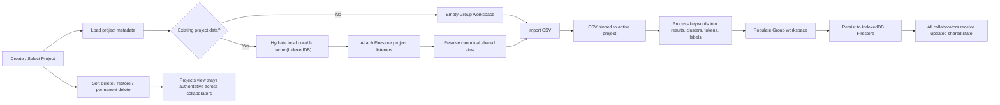
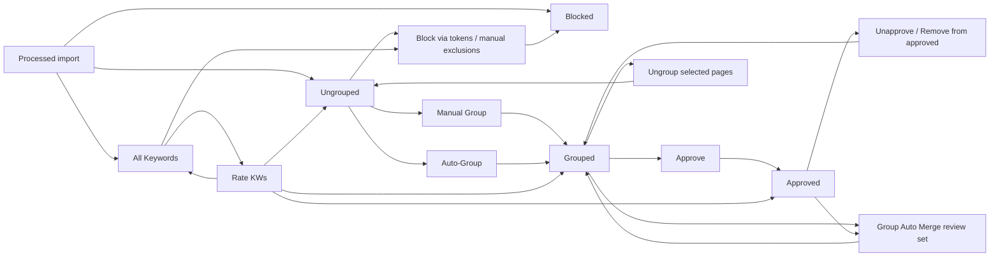
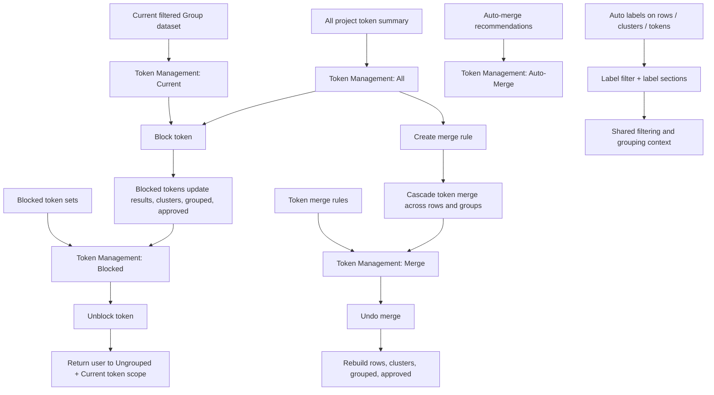
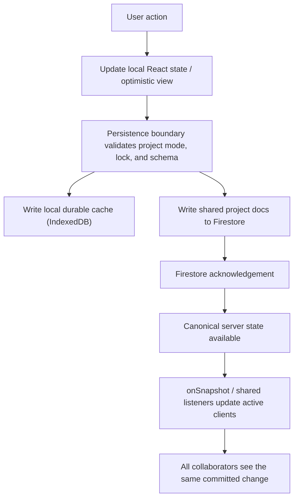
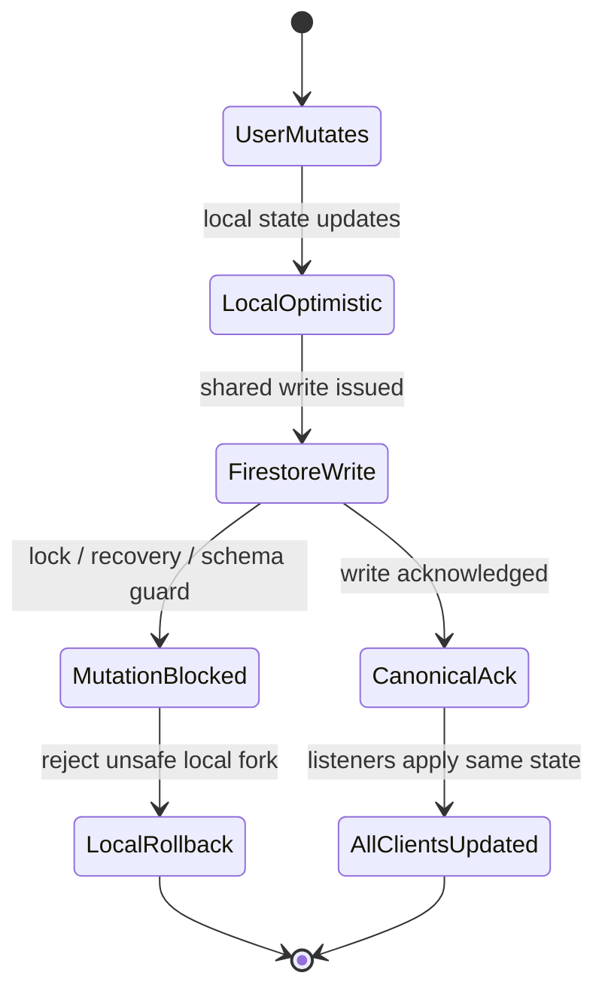

# Group And Project Flow

This document is the operator-facing visual map for the **Group** workspace.

> [!IMPORTANT]
> **Non-negotiable shared-state rule**
>
> - Every user-facing mutation must persist.
> - Shared projects use **Firestore as the authoritative shared source of truth**.
> - Any change made by one user must write through the persistence boundary to IndexedDB and Firestore, then become visible to all collaborators through shared listeners without manual refresh.
> - The app must never allow a browser-local-only fork of shared project data.

## Expected Shared Sync Model

This is the intended collaboration model for normal Group workspace editing:

- Every shared write gets a unique mutation ID so retries, acknowledgements, and listener echoes can be matched to one logical action.
- Shared mutable project state lives in small entity-scoped docs, not one giant whole-project mutable document.
- Each shared entity write uses revision-aware conflict protection so one user cannot silently overwrite another user's newer edit.
- Firestore listeners are the visibility path: once the write is acknowledged, all connected collaborators should converge on the same shared state.
- Project-wide locks should be reserved for true bulk operations such as large rewrites, imports, or other exclusive flows. Normal day-to-day grouping, approving, blocking, and organizing should not feel lock-heavy or fragile.
- Background canonical/meta reload is a syncing state, not automatically a hard read-only state. If the active `collab/meta` still points at the same `datasetEpoch/baseCommitId` as the last acknowledged writable canonical base, routine grouping can remain usable while the reload completes.
- If `collab/meta` has already moved to a different `datasetEpoch/baseCommitId`, routine edits must pause until that newer canonical state finishes loading. The app must not keep writing stale old-epoch entity docs during that window.

Layman's version:

- One user changes something.
- That specific change gets its own write identity.
- The app writes only the small shared item that changed.
- Firestore accepts it.
- All other users see the same change.
- Only large project-wide jobs should temporarily lock editing.

## 1. Project Lifecycle Flow

Key points:

- Project open clears the previous workspace, hydrates the selected project, then reconciles with Firestore.
- Project switching is blocked while protected in-flight work is active; the app rejects the change instead of letting writes land in the wrong project.
- CSV import is pinned to the project that was active when the file was chosen.
- Processed output feeds the Group workspace as `results`, `clusterSummary`, `tokenSummary`, groups, blocked keywords, blocked tokens, and label metadata.
- Shared-project data must not stop at a local cache write; the change is only complete when the shared persistence path has written canonical state and collaborators can observe it.
- Project lifecycle also includes soft delete, restore, and permanent delete flows that sync through Firestore and can clear the active workspace if the current project disappears or is deleted.

## 2. Keyword Management Flow

Current Keyword Management tabs:

- `Auto-Group`
- `Ungrouped`
- `All Keywords`
- `Grouped`
- `Auto Merge`
- `Approved`
- `Blocked`

Mutation rules:

- `Group`, `Approve`, `Unapprove`, `Ungroup`, `Auto-Group`, `Group Auto Merge`, keyword rating writes, and block-related actions are shared project mutations when a project is shared.
- `Group Auto Merge` analyzes the combined `Grouped` + `Approved` set, but accepted merges resolve back into the live `Grouped` dataset for re-review.
- Those mutations must flow through the persistence boundary and auto-sync to all collaborators.
- If the project is truly write-unsafe or lock-blocked, the app should reject the mutation instead of letting one user create unsynced local state.
- If the project is only reloading canonical shared state in the background and still has a safe writable canonical view, routine edits should remain available.

## 3. Token And Label Interaction Flow

Current Token Management subtabs:

- `Current`
- `All`
- `Merge`
- `Auto-Merge`
- `Blocked`

Label and token notes:

- `Current` is scoped to the currently filtered keyword-management view, not the whole project.
- `Current` can be driven by the active `Ungrouped`, `Grouped`, `Approved`, or `All Keywords` context depending on which keyword-management tab the user is in.
- Blocking or unblocking tokens changes the visible keyword/group dataset, so it is a shared mutation and must sync across collaborators.
- Token merge rules cascade across `results`, `clusterSummary`, `grouped`, and `approved` data; they are not local UI-only transforms.
- Label metadata is derived from the dataset, while `label_sections` are shared project entities that define label organization used across collaborators.

## 4. Shared Sync And Persistence Flow

Shared entity docs in the Group workspace:

- `groups`
- `blocked_tokens`
- `manual_blocked_keywords`
- `token_merge_rules`
- `label_sections`
- `activity_log`

Persistence boundaries:

- Shared projects treat Firestore as authoritative and IndexedDB as the canonical local durable mirror of acknowledged shared state.
- The app may show optimistic local state briefly, but that optimistic state must either be acknowledged and propagated or rejected and rolled back.
- Project operation locks and hard read-only recovery states exist to protect consistency. They must block unsafe writes rather than permit unsynced local divergence.
- Background canonical reload should surface as syncing/degraded status, not blanket read-only, when the active `collab/meta` identity still matches the last safe writable canonical base.
- If the active `collab/meta` identity no longer matches that last safe writable canonical base, the persistence boundary must fail closed until convergence finishes.
- Queued bulk AI/grouping flows should collapse to the latest pending intent when appropriate rather than replaying stale queued jobs after the user changes filters or context.

## 5. Collaboration Guarantees And Failure Boundaries

Collaboration guarantees:

- Any valid shared-project change made by one user should auto-sync to DB/Firebase and become visible to all users without manual refresh.
- Shared listeners should converge every connected client on the same canonical project state.
- The app should not silently allow one collaborator to mutate local-only project data that other collaborators cannot see.
- If a write is unsafe because of true canonical invalidity, lock ownership, or schema incompatibility, the correct behavior is to block the mutation, keep shared state authoritative, and avoid creating an unsynced local fork.
- Benign listener/meta churn by itself must not freeze routine grouping work.
- Rejected shared writes must not leave behind optimistic local-only state; they must roll back or recompose from canonical state immediately.

Out of scope:

- This document focuses on the **Group** workspace.
- `Generate` and `Content` are downstream workflows and are intentionally not modeled here beyond the shared persistence rules they inherit.

## 6. Current Gaps Vs Optimal Flow

This section is intentionally blunt. The diagrams above describe the **target** collaboration contract. The app is closer to that contract now, but not fully there yet.

### Overall assessment

- Current implementation vs optimal flow: **7.5 / 10**
- Biggest improvement made: the app is much less likely to enter the old sticky shared-sync/read-only trap during normal grouping work.
- Biggest remaining gap: some flows still treat **optimistic local apply** as "done" before the shared Firestore-backed write has been fully acknowledged.

### Gaps still to close

1. **Foreign project-wide bulk locks still block routine shared edits**

- Optimal flow:
  - project-wide locks should mainly protect true bulk rewrites
  - routine grouping, approving, ungrouping, and similar day-to-day edits should remain available whenever the current shared state is otherwise safe
- Current behavior:
  - if another client holds the active project operation lock, routine shared edits can still be blocked along with bulk edits
- User impact:
  - a collaborator running a bulk action can temporarily stop another user from doing normal grouping work
- Gap to close:
  - narrow foreign-lock blocking so routine entity-scoped edits are only blocked when they truly conflict with the active project-wide operation

2. **Some flows still use optimistic local success as the completion boundary**

- Optimal flow:
  - the app should only claim success once the shared mutation has been accepted and is on the listener path to collaborators
- Current behavior:
  - some flows still return success after local optimistic apply and queued shared persistence, not after confirmed shared acceptance
- Known high-risk examples:
  - token block / unblock
  - token merge / unmerge
  - some filtered auto-group apply paths
  - some group review auto-processor updates
- User impact:
  - one user can be told an action "worked" while another user may not see it yet, or may not see it if the shared write fails afterward
- Gap to close:
  - move these flows to the same acknowledged shared-write boundary now used by the hardened Group Auto Merge path

3. **Routine edit truthfulness is better, but not perfectly uniform yet**

- Optimal flow:
  - every routine Group mutation should follow the same rule for success, rollback, and user messaging
- Current behavior:
  - some actions already preserve selection/input and avoid false success when blocked
  - others still clear state or toast too early because their persistence helper returns after local apply
- User impact:
  - the user experience is more trustworthy than before, but not yet perfectly consistent across all Group actions
- Gap to close:
  - standardize all Group mutations on one shared "accepted vs rejected" result contract

4. **Blocked-token behavior is still conceptually mixed**

- Optimal flow:
  - the UI and docs should clearly distinguish:
    - project-blocked tokens
    - universal blocked tokens
- Current behavior:
  - both concepts still influence what the user sees in Blocked token management, but they are not surfaced distinctly enough in the operator flow
- User impact:
  - users can still be unsure whether a token was blocked in this project or blocked globally
- Gap to close:
  - show source/scope clearly in the Blocked view and document the distinction more explicitly in the UI itself

5. **Manual blocked-keyword exclusions are still not a clear first-class user flow**

- Optimal flow:
  - if manual blocked-keyword exclusions are part of the supported Group workflow, the user should have a clear UI entry point for them
- Current behavior:
  - the shared persistence model still includes `manual_blocked_keywords`, but the Group workflow does not expose that concept clearly as a normal day-to-day action
- User impact:
  - the persistence contract and the visible workflow are still slightly out of alignment
- Gap to close:
  - either expose this as a real user-facing action or remove it from operator-facing workflow language and keep it architecture-only

### What is already materially improved

- Background canonical/meta reload no longer has to mean blanket routine-edit freeze.
- The persistence layer now distinguishes syncing/reloading from true write-unsafe state.
- Failed optimistic V2 writes are handled more defensively instead of silently leaving local drift behind.
- Same-browser bulk spam is better contained.
- Group Auto Merge now uses a more truthful shared-write completion boundary than before.

### Practical expectation for users right now

- Normal shared grouping should be **substantially more stable** than before.
- Accepted shared edits should appear to collaborators in **near real time** through Firestore listeners.
- The remaining differences are mostly about:
  - lock scope still being broader than ideal
  - some flows still not using the strictest possible shared-ack completion rule
- So the app is in a meaningfully better state, but this document should not pretend the collaboration model is already at the final ideal in every path.
